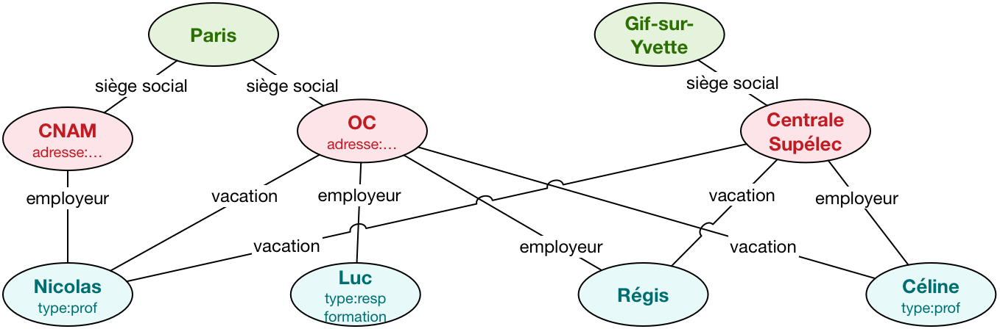

# BASE DE DONNÉES

## SGBDR/ SYSTEME DE BASE DE DONNÉES RELATIONNEL 

### Définition : base de données relationnelles

Les SGBD relationnels mettent au premier plan les relations entre les données. Celles-ci sont organisées en tables à deux dimensions: On parle alors de ligne et de colonnes.
Considérons une table client, voir la figure ci-dessous. Un enregistrement telle que la description des données d'un client spécifique correspond à une ligne. Chaque colonne correspond à un attribut spécifique : le nom, l'adresse, le téléphone...

Ainsi il est particulièrement aisé pour un programme ou directement par un utilisateur d'accéder à un client précis ou de trier, ou d'extraire les enregistrement clients selon une caractéristique, un attribut donc.

### Le relationnel, comment ça marche ?

Un SGBD relationnel organise les différentes données sous forme de tables. Chaque table est structurée en lignes et colonnes. Toutes les tables de la base de données peuvent être simplement rapprochées dès qu’elles partagent une même colonne (un attribut). Par exemple, la table « client » contient toutes les coordonnées des clients et la table « ventes » regroupe les différents achats réalisés par les clients.
Chacune des deux tables a une colonne commune : le numéro du client. Il sera possible de réaliser une jointure simple pour, par exemple, définir le chiffre d’affaires par client, éditer la liste des clients ayant commandé pour plus de 50 000 euros dans le mois, ou encore connaître les produits vendus par région. Pour cela, on utilise un langage standardisé d’interrogation des bases de données : SQL voir la figure ci-dessus.

La définition des tables de référence ne saurait être arbitraire. Il est important de structurer l’ensemble de la base de données pour pouvoir répondre à un maximum de requêtes* correspondantes aux besoins de l’entreprise, en ne réalisant que des jointures simples. Pour mieux maîtriser la conception du schéma relationnel*, il existe une normalisation : les formes normales (NFN). Ces dernières définissent trois niveaux de règles pour éviter les erreurs de conception, comme les redondances mal à propos pénalisant les évolutions futures de la base.

Une requête est une commande envoyée vers le SGBD pour rechercher, écrire ou lire des données de la base.
Le schéma relationnel décrit les tables et leurs relations.

Le Modèle "ACID" et la gestion des transactions
Le modèle ACID définit les règles des transactions pour garantir la cohérence de la base. C'est indispensable pour gérer les requêtes provenant de différentes applications. Une transaction permet justement d'envelopper plusieurs requêtes qui doivent impérativement s'exécuter séquentiellement en une même unité. Si jamais il s'avérait impossible de traiter la totalité de la transaction, le système revient à un état stable antérieur.
Atomicité : toutes les actions sont exécutées ou aucune.
Cohérence : la transaction doit placer le système en un état cohérent. Si ce n’est pas possible, elle revient à l’état stable
précédent.
Isolation : les changements intermédiaires, apportés à la base par la transaction en cours, ne sont pas vus par les autres transactions exécutées en parallèle depuis d’autres tâches avant la validation.
Durabilité : une fois validés, les changements apportés par la transaction sont durables.

## NOSQL

### Au fond, c'est quoi le NoSQL ?
Depuis les années 70, la base de données relationnelle était l'incontournable référence pour gérer les données d'un système d'information. Toutefois, face aux 3V (Volume, Velocity, Variety), le relationnel peut difficilement lutter contre cette vague de données. Le NoSQL s'est naturellement imposé dans ce contexte en proposant une nouvelle façon de gérer les données, sans reposer sur le paradigme relationnel, d'où le "Not Only SQL". Cette approche propose de relâcher certaines contraintes lourdes du relationnel pour favoriser la distribution (structure des données, langage d'interrogation ou la cohérence).

Dans un contexte bases de données, il est préférable d'avoir un langage de haut niveau pour interroger les données plutôt que tout exprimer en Map/Reduce. Toutefois, avoir un langage de trop haut niveau comme SQL ne facilite pas la manipulation. Et c'est en ce sens que l'on peut parler de "Not Only SQL", d'autres solutions peuvent être proposées pour résoudre le problème de distribution. Ainsi, le NoSQL est à la fois une autre manière d'interroger les données, mais aussi de les stocker.

Les besoins de stockage et de manipulation dans le cadre d'une base de données sont variables et dépendent principalement de l'application que vous souhaitez intégrer. Pour cela, différentes familles de bases NoSQL existent : Clé/Valeur, colonnes, documents, graphes. Chacune de ces familles répond à des besoins très spécifiques que nous allons développer par la suite, avec pour but in fine, de vous permettre de choisir votre solution NoSQL.

### Les clés-valeurs

Le but de la famille clé-valeur est l'efficacité et la simplicité. Un système clé-valeur agit comme une énorme table de hachage distribuée sur le réseau. Tout repose sur le couple Clé/Valeur. La clé identifie la donnée de manière unique et permet de la gérer. La valeur contient n'importe quel type de données.

Le fait d'avoir n'importe quoi implique qu'il n'y ait ni schéma, ni structure pour le stockage. D'un point de vue de bases de données, il n'y a pas la possibilité d'exploiter ni de contrôler la structure des données et de fait, pas de langage (SQL = Structured Query Language). En soit ce n'est pas un problème si vous savez ce que vous cherchez (la clé) et que vous manipulez directement la valeur.

Les seules opérations de type CRUD peuvent être utilisées :

* __Create__ (key,value)

* __Read__ (key)

* __Update__ (key,value)

* __Delete__ (key) 

Quels types d'applications pourraient correspondre à cette solution ? Voici quelques idées qui pourraient orienter votre choix : détection de fraude en temps réel, IoT, e-commerce, gestion de cache, transactions rapides, fichiers de logs, chat.

### Des lignes vers les colonnes

Traditionnellement, les données sont représentées en ligne, représentant l'ensemble des attributs. Le stockage orienté colonne change ce paradigme en se focalisant sur chaque attribut et en les distribuant. Il est alors possible de focaliser les requêtes sur une ou plusieurs colonnes, sans avoir à traiter les informations inutiles (les autres colonnes).

Cette solution est très adaptée pour effectuer des traitements sur des colonnes comme les agrégats (comptage, moyennes, co-occurences...). D'une manière plus concrète, elle est adaptée à de gros calculs analytiques. Toutefois, cette solution est beaucoup moins appropriée pour la lecture de données spécifiques comme pour les clés/valeurs.

Qui fait de l'orienté-colonnes ?

* __BigTable__ (Google)

* __HBase__ (Apache, Hadoop)

* __Spark SQL__ (Apache)

* __Elasticsearch__ (elastic) -> moteur de recherche

Quelques exemples d'applications : Comptage (vote en ligne, compteur, etc), journalisation, recherche de produits dans une catégorie, reporting à large échelle.

### La gestion de documents
Les bases orientées documents ressemblent sans doute le plus à ce que l'on peut faire dans une base de données classique pour des requêtes complexes. Le but de ce stockage est de manipuler des documents contenant des informations avec une structure complexe (types, listes, imbrications). Il repose sur le principe du clé/valeur, mais avec une extension sur les champs qui composent ce document.

L'avantage de cette solution est d'avoir une approche structurée de chaque valeur, formant ainsi un document. De fait, ces solutions proposent des langages d'interrogation riches permettant de faire des manipulations complexes sur chaque attribut du document (et sous-documents) comme dans une base de données traditionnelles, tout en passant à l'échelle dans un contexte distribué.

 Quelles solutions pour gérer vos documents :

* __MongoDB__ (MongoDB) : ADP, Adobe, Bosch, Cisco, eBay, Electronic Arts, Expedia, Foursquare

* __CouchBase__ (Apache, Hadoop) : AOL, AT&T, Comcast, Disney, PayPal, Ryanair

* __DynamoDB__ (Amazon) : BMW, Dropcam, Duolingo, Supercell, Zynga

* __Cassandra__ (Facebook -> Apache) : NY Times, eBay, Sky, Pearson Education

Cassandra est souvent considérée comme une solution orientée colonnes. C'est une solution orientée documents appelée "wide-column store", dans le sens où le document est structuré comme en relationnel. La confusion vient du fait que l'on y définit des colonnes et des familles de colonnes dans le schéma, ce qui est différent du stockage de "colonnes".

 Quelques exemples d'utilisation : gestion de contenu (bibliothèques numériques, collections de produits, dépôts de logiciels, collections multimédia, etc.), framework stockant des objets, collection d’événements complexes, gestion des historiques d’utilisateurs sur réseaux sociaux.

### Et les graphes ?

Les trois premières familles NoSQL n'adressent pas le problème de corrélations entre les éléments. Prenons l'exemple d'un réseau social : dans certains cas, il devient très complexe de calculer la distance entre deux personnes non directement connectées. Et c'est ce type d'approche que résolvent les bases orientées Graphe.

Dans la base orientée graphe, les données stockées sont : les nœuds, les liens et des propriétés sur ces nœuds et ces liens. Les requêtes que l'on peut exprimer sont basées sur la gestion de chemins, de propagations, d'agrégations, voire de recommandations. Toutefois, contrairement aux solutions précédentes la distribution des nœuds sur le réseau n'est pas triviale.

Quelles bases de données gèrent de gros graphes ?

* __Neo4j__ : eBay, Cisco, UBS, HP, TomTom, The National Geographic Society

* __OrientDB__ (Apache) : Comcast, Warner Music Group, Cisco, Sky, United Nations, VErisign

* __FlockDB__ (Twitter) : Twitter

Quelques idées d'applications reposant sur des bases orientées graphes : réseaux sociaux (recommandation, plus court chemin, cluster...), réseaux SIG (routes, réseau électrique, fret...), web social (Linked Data).

## Source 
piloter.org/techno/support/base-de-donnees-relationnelle-definition.htm
https://fr.wikipedia.org/wiki/NewSQL
https://openclassrooms.com/fr/courses/4462426-maitrisez-les-bases-de-donnees-nosql/4462433-choisissez-votre-famille-nosql
